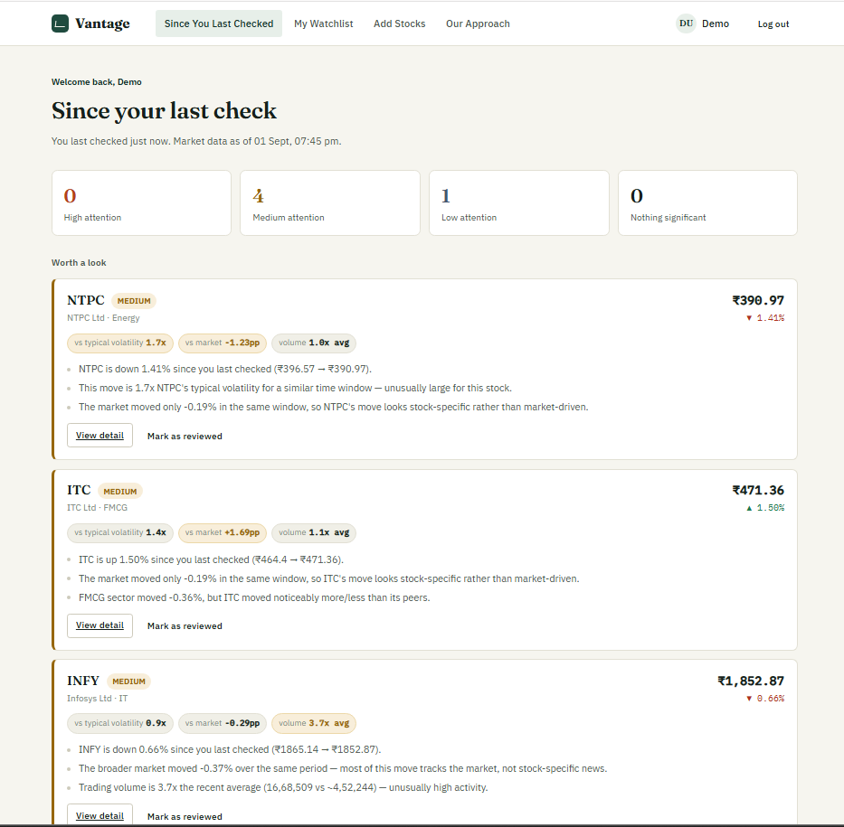

# Vantage — Smart Market Watchlist

<div align="center">

### *A watchlist shouldn't make you monitor your stocks. It should monitor them for you.*

**Built for Groww CODE 2026 — "Build a Smart Market Watchlist."**

[](https://react.dev/)
[](https://nodejs.org/)
[](https://expressjs.com/)
[](https://www.sqlite.org/)
[](https://developer.mozilla.org/en-US/docs/Web/JavaScript)
[](#-testing--quality)

</div>

---

## 💡 The Idea

I started with a simple question:

> **When I come back to my watchlist, can software tell me what I actually missed — and what is worth looking at?**

Most watchlists are good at showing **what changed**.

Vantage explores a different question:

> **What changed enough for me to care?**

Every time you open Vantage it answers two things: **what did I miss since I last checked**, and **what, out of that, actually deserves my attention right now**. It never asks you to scan a wall of tickers, and it never tells you to buy or sell anything.

Instead of presenting another wall of prices and charts, Vantage looks at what changed **since the user's previous check**, puts that movement into context, and explains why it may or may not deserve attention.

> **A large movement isn't necessarily meaningful. Context matters.**

---

## 🎯 The Problem

A stock moving 5% sounds important — until you discover that:

- the stock normally moves 6%
- the entire market also moved 5%
- the sector moved similarly
- trading volume did not change
- or the underlying data is stale

A fixed percentage threshold cannot capture that context.

Vantage therefore evaluates several signals together before deciding how much attention a change deserves.

---

## 🖥️ The Product

### Since Your Last Check

The main experience is built around the moment a user returns to the application.

Instead of manually scanning every stock, Vantage groups changes into attention levels:

| Level | Meaning |
|:---:|---|
| 🔴 **High** | Strong evidence that the movement deserves attention |
| 🟠 **Medium** | Some meaningful signals are present |
| 🟡 **Low** | A smaller or less unusual change |
| ⚪ **None** | Nothing significant since the previous checkpoint |

The classification is **not presented as a black-box score**. The user can inspect the evidence behind it.

<div align="center">



<br>

<sub><b>Dashboard — what changed since the user's previous check</b></sub>

</div>

---

## 🔍 From Movement to Meaning

For every relevant stock, Vantage evaluates:

1. Change since the user's last check
2. The stock's typical volatility
3. Broader market movement
4. Sector movement
5. Trading-volume anomalies
6. Data freshness
7. Conflicting market data

```text
                  USER CHECKPOINT
                         │
                         ▼
              Change since last check
                         │
          ┌──────────────┼──────────────┐
          ▼              ▼              ▼
     Volatility       Market          Sector
       context        context         context
          │              │              │
          └──────────────┼──────────────┘
                         ▼
                  Trading volume
                         │
                         ▼
                   Data quality
                         │
                         ▼
                Attention Engine
                         │
                         ▼
              Evidence-backed result
```

<p align="center">
  <sub><b>The system combines user history, market context, volatility, volume, and data quality before producing an explainable result.</b></sub>
</p>

---

## 🧠 What Makes Vantage Interesting

The interesting part isn't another stock chart.

It is the **decision process around whether a change is actually meaningful**.

A 5% movement can mean very different things depending on context.

```text
Stock:    +5%
Market:    0%
Volume:   High
              ↓
     Potentially meaningful
```

versus:

```text
Stock:    +5%
Market:   +5%
             ↓
     Mostly market-wide movement
```

Vantage therefore avoids treating a fixed percentage as the definition of importance. Instead, it combines multiple signals and produces a plain-language explanation.

It also deliberately separates evidence from financial advice. Vantage does not tell users to buy or sell — it explains what changed and why the system classified it that way.

---

## 🔄 User Flow

```text
User checks watchlist
        ↓
System records checkpoint
        ↓
Market state changes
        ↓
User returns later
        ↓
Compare against previous checkpoint
        ↓
Evaluate contextual signals
        ↓
Classify attention level
        ↓
Show evidence
        ↓
User inspects reasoning
        ↓
User marks stock as reviewed
```

The important state is therefore not simply the latest market price.

It is **what the user knew at their previous checkpoint**.

---

## ⚙️ Architecture

```text
┌────────────────────────────────────┐
│            React Client            │
│                                    │
│  Dashboard · Watchlist · Detail    │
│  Admin                             │
└──────────────────┬─────────────────┘
                   │
                REST API
                   │
                   ▼
┌────────────────────────────────────┐
│          Express Server            │
│                                    │
│ Authentication                     │
│ Watchlists                         │
│ Checkpoints                        │
│ Market Simulation                  │
│ Attention Engine                   │
│ Data Quality Checks                │
└──────────────────┬─────────────────┘
                   │
                   ▼
┌────────────────────────────────────┐
│              SQLite                │
│                                    │
│ Users · Stocks · Prices            │
│ Watchlists · Snapshots             │
│ Market / Sector Data               │
└────────────────────────────────────┘
```

### Project structure

```text
groww-watchlist/
├── server/                         Express REST API + SQLite persistence
│   └── src/
│       ├── index.js                Entrypoint (reads PORT, starts DB + app)
│       ├── app.js                  Express app factory + route mounting
│       ├── auth.js                 JWT sign/verify, authMiddleware, requireAdmin
│       ├── db.js                   SQLite schema + demo/admin seed data
│       ├── marketState.js          Reads admin_state row → current simulated universe
│       ├── data/
│       │   ├── symbols.js          15-stock catalog + sector metadata
│       │   └── simulate.js         Deterministic seeded market simulator (6 scenarios)
│       ├── engine/
│       │   └── changeEngine.js     Meaningful-change scoring engine (pure functions)
│       ├── routes/                 Auth, watchlist, feed, stocks, admin, profile
│       └── __tests__/
│           ├── engine.test.js      Engine unit tests
│           ├── api.test.js         API / integration tests
│           └── journey.e2e.test.js End-to-end application journey
│
└── client/                         React 19 + Vite + React Router SPA
    └── src/
        ├── api.js                  Fetch wrapper (JWT in localStorage, typed error handling)
        ├── context/
        │   └── AuthContext.jsx     Authentication state
        ├── components/             Layout, route guards, shared UI (badges, states, formatters)
        └── pages/                  Landing, Login, Signup, Dashboard, Watchlist,
                                    ManageStocks, StockDetail, Profile, About, Admin
```

### Separation of concerns

The client focuses on presenting the user's state and reasoning. **The client never computes a change verdict — it only renders what the API returns.**

The backend owns:

- application logic
- persistence
- checkpoint state
- market simulation
- attention evaluation
- data-quality handling

```text
React Client
     │
     │ requests
     ▼
Express API
     │
     ▼
Change Engine
     │
     ├── Price change
     ├── Volatility
     ├── Market context
     ├── Sector context
     ├── Volume
     └── Data quality
     │
     ▼
Evidence-backed result
     │
     ▼
React renders the result
```

All scoring, staleness, and conflict logic lives in `engine/changeEngine.js`, a **dependency-free module of pure functions**, so it can be unit-tested independently from Express, SQLite, and HTTP.

### Why simulated data, not a live feed?

Vantage uses simulated market data deliberately. The brief asks for a **reliable, deterministic demonstration**, not a live trading integration.

`data/simulate.js` generates each symbol's tick series from a seeded pseudo-random generator (`mulberry32`), using `symbol + scenario` as the seed. Re-generating a scenario always produces byte-identical output — there is no `Math.random()` anywhere in the data path.

```text
symbol + scenario
       │
       ▼
   seeded PRNG
       │
       ▼
 deterministic tick series
       │
       ▼
 same scenario → same market state
```

The simulator is intentionally isolated from the attention engine. The market-data source can be replaced with a real-time provider in the future without changing the core reasoning logic.

---

## 🗃️ Data Model

Vantage uses **SQLite** (`server/src/db.js`) to persist authentication, watchlists, user checkpoints, and the simulated market state.

| Table | Columns | Purpose |
|---|---|---|
| `users` | id, email, password_hash, name, role, created_at, last_checked_at | Authentication, role (`user` / `admin`), and when the user last opened the feed |
| `watchlist_items` | user_id, symbol, added_at | Which stocks a user tracks (unique per user + symbol) |
| `snapshots` | user_id, symbol, step, price, volume, seen_at | **The "last seen" baseline** — one row per user + symbol, overwritten on view / review |
| `admin_state` | scenario, current_step | Single-row global simulated clock + active scenario |

### The key concept: snapshots

The `snapshots` table powers the **"Since Your Last Check"** experience.

- When a stock is added, Vantage records its current price, volume, and simulation step as the user's **baseline**.
- When the user marks a stock as reviewed (`POST /watchlist/:symbol/ack`), that snapshot becomes the **new baseline**.
- The next time the feed is evaluated, the current market state is compared against that stored checkpoint — not against an arbitrary fixed percentage.

```text
Previous user checkpoint
          │
          ▼
   Stored snapshot
          │
          │       compare
          ├──────────────────► Current market state
          │
          ▼
   Contextual analysis
          │
          ▼
   Attention result
```

This is what allows Vantage to answer:

> **"What changed since I last checked?"**

---

## 🔌 API

All application APIs are exposed under `/api` (JSON, JWT bearer auth except signup / login).

| Method | Endpoint | Purpose |
|---|---|---|
| `POST` | `/auth/signup` | Create an account — validates email, password (≥ 6 chars), name; returns `{ token, user }` |
| `POST` | `/auth/login` | Authenticate a user; returns `{ token, user }` |
| `GET` | `/auth/me` | Get the current user from the token |
| `GET` | `/feed` | **The attention feed** — evaluates every watchlist item against its snapshot, sorted HIGH → MEDIUM → LOW → NONE |
| `GET` | `/watchlist` | Get the user's watchlist with live price + stale / conflict flags |
| `POST` | `/watchlist` | Add a stock (`{ symbol }`) and immediately write its baseline snapshot |
| `DELETE` | `/watchlist/:symbol` | Remove a stock and its snapshot |
| `POST` | `/watchlist/:symbol/ack` | Mark a stock as reviewed (resets the baseline to right now) |
| `GET` | `/stocks?q=` | Search the stock catalogue (symbol / name / sector) |
| `GET` | `/stocks/:symbol` | Full detail: chart, market / sector %, volume, freshness, and the `whyThisMatters` verdict |
| `GET` / `PATCH` | `/profile` | View or update profile (name) |
| `POST` | `/profile/change-password` | Change password (requires current password) |
| `GET` | `/admin/state` | **Admin only** — scenario, simulation step, stale / conflicting symbols, user count |
| `POST` | `/admin/scenario` | **Admin only** — switch the simulation scenario (`{ scenario }`) |
| `POST` | `/admin/advance` | **Admin only** — advance the simulated clock (`{ steps }`) |
| `POST` | `/admin/reset` | **Admin only** — wipe and re-seed demo data |
| `GET` | `/health` | Liveness check |

Admin endpoints are protected by `requireAdmin` middleware. A normal user's JWT is rejected with **`403 Forbidden`** before any admin route body runs.

---

## 🧠 The Meaningful-Change Engine

The engine (`server/src/engine/changeEngine.js`) takes a stock's **last-seen checkpoint** (price, volume, simulation step) and its **current tick**, then evaluates whether the change deserves attention.

It evaluates the movement relative to the stock's own behaviour and the broader market context before assigning an attention level.

```text
Raw price change
       │
       ▼
Is the move unusual for this stock?
       │
       ▼
Did the market / sector move similarly?
       │
       ▼
Is trading volume abnormal?
       │
       ▼
Is the underlying data fresh and consistent?
       │
       ▼
     Score
       │
       ▼
┌─────────────────────────┐
│ HIGH / MEDIUM / LOW /   │
│ NONE                    │
└────────────┬────────────┘
             │
             ▼
      Evidence + Reasons
```

### How the engine reasons

1. **Elapsed ticks (`N`)** — how many simulated ticks have passed since the user's checkpoint. `N = 0` → `NONE`, "no new data."
2. **Price movement** — the raw % price change since the snapshot.
3. **Volatility-adjusted significance** — compares the move against the stock's own trailing volatility rather than a fixed threshold.
4. **Market context** — how much of the movement can be explained by the broader market.
5. **Sector context** — whether the stock is moving with or against its sector.
6. **Volume anomaly** — current volume versus the trailing average.
7. **Data quality** — checks for stale or conflicting market data.
8. **Attention score** — combines the signals into a score from 0–100.
9. **Explanation** — converts the result into plain-language evidence with the actual numbers in it.

### Volatility-adjusted movement

Vantage uses the stock's own recent behaviour as the reference point.

The stock's trailing volatility (the standard deviation of its last **20 ticks'** returns) is scaled by `√N` to get an **expected move size for this specific time gap**. Then:

```text
zScore = pctChange / expectedMoveStdPct
```

```text
Stock's historical volatility
        +
Elapsed time (scaled by √N)
        ↓
Expected move for this window
        ↓
Actual movement ÷ expected movement
        ↓
Volatility-adjusted significance
```

A 5% move only scores high if it is large **relative to that stock's own normal noise**. A 5% move in a normally stable stock can be more unusual than a 5% move in a highly volatile stock.

### Market and sector context

The engine reads the market index and the stock's sector index over the **same window** and computes:

```text
relativeToMarket = pctChange − marketWindowPct
```

```text
Stock movement
      −
Market movement
      =
Relative movement
```

For example:

```text
Stock:     +5%
Market:     0%
             ↓
   More stock-specific movement
```

versus:

```text
Stock:     +5%
Market:    +5%
             ↓
   Mostly market-wide movement
```

In the second case `relativeToMarket ≈ 0`, so the move is heavily discounted.

### Volume anomaly

Current trading volume is compared against the stock's trailing 20-tick average. A volume level of **2.5× or more** is treated as an anomaly and contributes additional evidence to the attention result.

### Scoring logic

The attention score combines several independent signals rather than relying on a single percentage threshold.

| Signal | Contribution | Purpose |
|---|---:|---|
| **Volatility-adjusted movement** | Up to 50 pts (from `\|zScore\|`, capped at z = 5) | Measures how unusual the move is relative to the stock's normal behaviour |
| **Market-relative movement** | 20 pts | Awarded when the move exceeds what market movement alone explains |
| **Volume anomaly** | 20 pts | Detects unusually high trading activity |
| **Data quality** | Reliability constraint | Prevents stale or conflicting data from creating misleading confidence |

The final score is **capped at 100** and mapped to an attention level:

| Score | Attention |
|---|---|
| `≥ 55` | 🔴 **HIGH** |
| `≥ 25` | 🟠 **MEDIUM** |
| `≥ 8` | 🟡 **LOW** |
| `< 8` | ⚪ **NONE** |

The score is never shown as the only answer. **Every non-trivial result includes the evidence that contributed to the classification.**

### Why this approach matters

A fixed rule such as *"alert me whenever a stock moves more than 5%"* generates noisy alerts, because the same movement has very different meanings in different market conditions.

| Situation | Interpretation |
|---|---|
| Stock +5%, market +5% | Much of the movement may be market-wide |
| Stock +5%, market +0.2% | The stock moved substantially more than the market |
| Stock +5%, unusually high volume | Additional evidence that the movement deserves attention |
| Stock +5%, but data is stale | The signal should not be treated with high confidence |

> **The goal is not to surface the biggest movement. The goal is to surface the movements that are most unusual relative to their context — and explain why.**

---

## 🧾 Evidence-First Reasoning

Vantage does not return an attention level as an unexplained score. Every non-trivial result includes the evidence behind it, so the user can inspect **why** the system reached that result.

The API can return evidence such as:

- **Price change** since the user's previous checkpoint
- **Expected movement** for the elapsed time window
- **Volatility multiple** relative to the stock's recent behaviour
- **Market movement** during the same period
- **Sector movement**
- **Volume anomaly**
- **Data freshness**
- **Conflicting prices**, when applicable

Example:

```text
RELIANCE

Price change:          +5.2%
Typical volatility:     1.7%
Volatility multiple:    3.1×
Market movement:       +0.2%
Volume anomaly:        Detected
Data freshness:        Fresh

                         ↓

                  HIGH ATTENTION

                         ↓

"This move is substantially larger than
RELIANCE's typical movement for a similar
time window."

"The market moved only +0.2% during the
same period."

"Trading volume is significantly above
its recent average."
```

---

## 🛡️ Reliability & Data Quality

Vantage treats **data quality as part of the decision**, evaluated alongside scoring rather than as an afterthought.

### Stale data

If a symbol has not received a *real* update for **6 or more ticks (30 simulated minutes)**, Vantage flags it as `stale: true` with a plain-language freshness warning.

A stale signal **cannot produce a `HIGH` result**. If the calculated result would otherwise be HIGH, it is capped at **MEDIUM** — the engine doesn't let a frozen price masquerade as a confident high-attention signal.

### Conflicting data

When two simulated market feeds report different prices for the same symbol, Vantage does **not silently average or discard the disagreement**. Both values are surfaced to the user:

- **Primary price** (`evidence.primaryPrice`)
- **Secondary price** (`evidence.secondaryPrice`)
- **Conflict warning**

This makes uncertainty visible instead of hiding it behind a single number.

---

## 🔬 Deterministic Scenario Simulation

The simulator includes **six deterministic scenarios**, scripted into specific symbols in `simulate.js`, so the reasoning engine can be exercised reproducibly — both in tests and live via the admin panel.

A judge should be able to trigger a scenario and reliably observe the intended behaviour instead of depending on random market movements.

| Scenario | What it demonstrates | Expected behaviour |
|---|---|---|
| 🟢 `normal` | Ordinary, routine market movement | Most stocks remain LOW or NONE |
| 🔴 `unusual_movement` | A stock moves significantly relative to its normal volatility | The affected stock (RELIANCE) receives increased attention |
| 📊 `high_volume` | A price movement accompanied by an abnormal volume spike | The volume anomaly contributes to the result |
| 🌐 `market_wide` | A large movement largely explained by the broader market | The stock's movement is discounted when the market moved similarly |
| ⚠️ `stale_data` | A stock's market data stops updating (HDFCBANK) | Freshness warning appears and HIGH is capped at MEDIUM |
| 🔀 `conflicting_data` | Two market feeds disagree on the current price (ICICIBANK) | Both prices are surfaced instead of silently choosing one |

The simulator is **not** intended to represent real-time investment data. Its purpose is to provide a controlled environment for testing the reasoning engine and demonstrating its behaviour.

---

## 🔐 Authentication & Access Control

Vantage uses **JWT-based authentication** with explicit **role-based authorization**.

### Authentication

- Passwords are validated during signup / login and stored as **password hashes**.
- Successful authentication returns a JWT containing the user's identity and role.
- Protected API routes require a valid `Authorization: Bearer <token>` header.
- Invalid or missing tokens are rejected (`401`) before protected route logic executes.

Users can create an account, log in, maintain their own watchlist, view their attention feed, mark stocks as reviewed, update their profile, and change their password.

### Authorization

| Access Level | Regular User | Admin |
|---|:---:|:---:|
| View dashboard | ✅ | ✅ |
| Manage watchlist | ✅ | ✅ |
| View stock details | ✅ | ✅ |
| Update profile | ✅ | ✅ |
| Change password | ✅ | ✅ |
| Change market scenario | ❌ | ✅ |
| Advance simulation | ❌ | ✅ |
| Reset demo data | ❌ | ✅ |
| Inspect admin state | ❌ | ✅ |

Admin endpoints are protected by `requireAdmin` middleware; a normal user's JWT receives **`403 Forbidden`**.

The admin interface (`/admin`) is also **not linked from the regular user navigation**, adding a further separation between the evaluation controls and the normal product experience. It exists only to control the deterministic demo environment.

---

## 🧪 Testing & Quality

Vantage includes **39 automated tests** (`server/src/__tests__/`) using **Jest** and **Supertest**.

| Test layer | What is verified |
|---|---|
| **Unit tests** | Scoring, classification, volatility logic, determinism, stale / conflicting data |
| **API tests** | Authentication, watchlists, feeds, admin authorization, profiles, persistence |
| **Journey test** | Complete user → admin → scenario change → attention result → review workflow |

### Unit tests — `engine.test.js`

Pure functions, no DB or HTTP.

- Score → level boundary mapping
- Determinism: same inputs ⇒ identical output, and `generateUniverse` reproducibility across calls (proving nothing is randomized per refresh)
- No-prior-context baseline case and zero-elapsed-time case
- `unusual_movement` correctly flags `HIGH`
- `market_wide` scores **lower** than an idiosyncratic move of similar raw size — the core *"meaningful ≠ big"* claim, tested directly rather than just asserted in prose
- `high_volume` flags the volume-specific reason
- `stale_data` flags `stale`, includes `staleMinutes`, and caps the level below `HIGH`
- `conflicting_data` surfaces both prices and never silently merges them

### API / integration tests — `api.test.js`

Real Express app + real in-memory SQLite per test.

- Signup validation (bad email / short password / empty name), duplicate signup, bad login
- Protected-route `401` on missing / invalid token
- Watchlist add / remove, unknown-symbol rejection, duplicate rejection, baseline snapshot on add
- Feed ordering invariant (HIGH / MEDIUM / LOW before NONE) and evidence-on-every-alert invariant
- Admin `403` for non-admin users; scenario / advance / reset verified end-to-end, including that an admin-triggered scenario change is visible in a *different* user's feed
- Stock catalogue search, `404` for unknown symbol, detail payload shape
- Profile update and password-change validation
- Persistence across a simulated server restart (new `createApp(db)` instance, same DB connection)

### End-to-end journey test — `journey.e2e.test.js`

One continuous scenario against a real app and a real DB, chaining the exact critical path a judge would walk:

```text
demo user logs in
      ↓
sees existing 5-stock watchlist
      ↓
dashboard loads with evidence on every item
      ↓
admin logs in separately
      ↓
403 confirms a user token cannot reach admin routes
      ↓
admin switches to `unusual_movement` and advances simulated time
      ↓
the same user's dashboard now surfaces RELIANCE as HIGH / MEDIUM
with numeric evidence (pctChange, reasons)
      ↓
user marks it reviewed → verdict resets to NONE
      ↓
review + watchlist state survive a simulated server restart
```

### Product invariants verified

- The same simulation inputs produce the same outputs
- Attention levels are correctly classified
- Market-wide movement receives different treatment from idiosyncratic movement
- High-volume events generate volume-specific evidence
- Stale data cannot produce an unqualified **HIGH** result
- Conflicting prices are surfaced rather than silently merged
- Non-admin users cannot access admin endpoints
- Watchlist and checkpoint state persists across application restarts

### Run the tests

```bash
cd server
npm install
npm test
```

Expected result:

```text
39/39 tests passing
```

### A note on browser (Playwright) E2E

A browser-driven Playwright layer was evaluated and **deliberately not added**. The build sandbox's network allow-list permits `registry.npmjs.org` (so the `playwright` package installs) but blocks the browser-binary CDN — `curl -I https://playwright.azureedge.net` returns `403 host_not_allowed` — so `npx playwright install` cannot succeed there, and shipping a browser-test config that fails in CI would destabilize the project.

The journey test instead exercises the identical request path (auth, dashboard, admin, feed recomputation, persistence) at the HTTP layer, which is where all of this product's actual logic lives — the React layer is a thin renderer of what these endpoints return.

### Continuous integration

`.github/workflows/ci.yml` runs `npm ci && npm test` for the server and `npm ci && npm run build` for the client on every push / PR to `main`.

---

## 🚀 Demo Instructions

```bash
# 1. Server (default port 4000)
cd server
npm install
npm start
# → "Smart Watchlist API listening on http://localhost:4000"

# 2. Client (separate terminal, default port 5173)
cd client
npm install
npm run dev
```

Open the client URL and log in with the seeded accounts:

| Role | Email | Password | Notes |
|---|---|---|---|
| **User** | `demo@watchlist.app` | `demo1234` | Pre-loaded with a 5-stock watchlist and a real baseline snapshot, so "Since your last check" has something to show immediately |
| **Admin** | `admin@watchlist.app` | `admin1234` | Visit `/admin` (not linked from the regular nav) to switch scenarios, advance the simulated clock, inspect stale / conflicting symbols, and reset demo data |

### Recommended judge demo flow

1. **Log in as the demo user** (`/login`, pre-filled). With the default `normal` scenario the dashboard is mostly quiet — which is itself the point: the product is willing to say *"nothing significant"* instead of manufacturing alerts.
2. **Open a second tab, log in as admin**, and go to `/admin`. Each scenario card explains what it demonstrates, and the simulated clock / data-quality panel shows the current state.
3. **Switch the scenario to Unusual Movement**, then click **Advance 20 ticks** once or twice.
4. **Reload the demo user's dashboard.** RELIANCE should now show as `HIGH` / `MEDIUM`, with an evidence chip row and plain-language reasons naming the actual % move, its volatility multiple, and the (flat) market move in the same window. Open the stock's detail page to see the full **"How we got here"** pipeline (change → volatility → market → sector → volume → data quality → result).
5. **Click "Mark as reviewed"** on RELIANCE — the verdict resets to `NONE` because the baseline has moved forward.
6. **Back in `/admin`, try Stale data and Conflicting data.** Reload the dashboard / detail page for **HDFCBANK** and **ICICIBANK** respectively to see the freshness warning and the side-by-side conflicting prices.
7. **Use "Reset demo data"** to return to a clean baseline for a re-run.

---

## ⚖️ Trade-offs & What Would Change at Scale

- **SQLite / single process** — right for a scored demo (zero setup, file-based, fast). At real scale this becomes Postgres, with `snapshots` and `watchlist_items` sharded / indexed by `user_id`, and the simulated universe replaced by a real streaming market-data ingest. The `marketState.js` abstraction boundary is designed so swapping the data source doesn't touch the engine or routes.
- **In-memory universe cache** (`getUniverse` in `simulate.js`) — fine for 15 symbols computed once per scenario. A production system would precompute and store index and volatility series in a time-series store and query windows instead of recomputing from an in-memory array.
- **Global simulation clock** (`admin_state`, single row) — intentional, for a shared, demoable, reproducible state across all users / judges hitting the same deployment. A multi-tenant production system would key simulated / real time per environment, not globally.
- **JWT in `localStorage`** on the client — acceptable for a demo. A production app would move to `httpOnly` cookies + refresh tokens to reduce XSS exposure.
- **Fixed windows and thresholds** (20-tick volatility / volume windows, 2.5× volume threshold, z-bands) — chosen and tuned by hand against the six scenarios rather than fit to real historical data. A production version would calibrate these per symbol from actual historical distributions.

---

## ☁️ Deployment Readiness

The app is two independently deployable pieces; nothing here assumes a specific host.

### Server (`server/`)

| Setting | Details |
|---|---|
| `PORT` | Read from the environment (`server/src/index.js`); defaults to `4000` locally. Any host that injects `PORT` (Render, Railway, Fly, etc.) works without code changes |
| `JWT_SECRET` | Read from the environment (`server/src/auth.js`); falls back to a dev value locally. **Must be set explicitly in any real deployment** — see `server/.env.example` |
| `CORS_ORIGIN` | Optional, comma-separated list of allowed origins (`server/src/app.js`). If unset, CORS stays fully open (local-dev behaviour); set it to your deployed frontend's origin(s) in production |
| Start command | `npm start` (`node src/index.js`) — no build step required (plain CommonJS Node) |

**Persistence:** SQLite via `better-sqlite3`, stored in a single file (`server/data.sqlite*`, gitignored). This is intentional for a judged demo — zero external dependencies, instant cold start, deterministic. The trade-off: on most PaaS hosts the filesystem is ephemeral across deploys / restarts, so demo and admin seed data would reset on redeploy (not on every request — only on a fresh container). For a persistent production deployment this would move to managed Postgres; `db.js` is the only file that would need to change, since all routes go through prepared statements against a single `db` handle passed into `createApp(db)`.

### Client (`client/`)

| Setting | Details |
|---|---|
| `VITE_API_URL` | The only required config, used by `client/src/api.js`; falls back to `http://localhost:4000/api`. Set it to the deployed server's URL at build time (see `client/.env.example`) |
| Build command | `npm run build` → static `dist/` (verified building cleanly, ~185 KB gzipped JS) |
| Hosting | Deploy `dist/` to any static host (Vercel, Netlify, S3 + CDN, etc.) — no server-side rendering required |

### Secrets

No credentials are committed. `.gitignore` excludes `.env` / `.env.local` and the generated SQLite files, and both `.env.example` files document the required variables without real secrets.

The seeded demo and admin passwords in this README are **intentionally shared for evaluation only** — they are not production credentials and should be rotated or removed for any real deployment.
